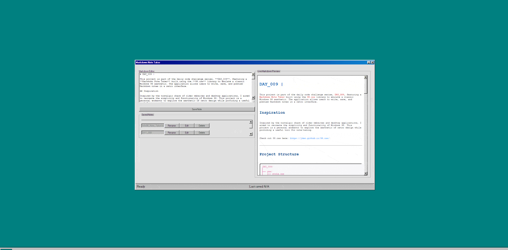

# DAY_009 | Markdown Note Taker

This project is part of the daily code challenge series, **DAY_009**, featuring a **Markdown Note Taker** built using the **98.css** library to emulate a classic Windows 98 aesthetic. The application allows users to write, save, and preview Markdown notes in a retro interface.

## Inspiration

Inspired by the nostalgic charm of older websites and desktop applications, I aimed to recreate the simplicity and functionality of Windows 98. This project is a personal endeavor to explore the aesthetic of retro design while providing a useful tool for note-taking.

Check out [98.css](https://jdan.github.io/98.css/)

## Visual Demo


---

## Project Structure

```bash
DAY_009/
│
├── css/
│   ├── style.css
│   └── index.css
├── fonts/
│   └── helveticaneue.woff2
├── images/
│   └── check the folder lol
├── js/
│   ├── app.js
│   └── script.js
├── index.html
└── notes.html
```

---

## Features

- **Markdown Editor**: Users can write their notes using Markdown syntax.
  
- **Live Preview**: See your Markdown notes rendered in real-time as you type.

- **Save and Edit Notes**: Save notes to local storage, edit existing notes, and rename them.

- **User-Friendly Interface**: Built with a retro Windows 98 look, enhancing the user experience.

---

## How to Run

1. **Clone the repository**:

   ```bash
   git clone https://github.com/thounny/DAY_009.git
   ```

2. **Navigate to the project directory**:

   ```bash
   cd DAY_009
   ```

3. **Open the `index.html` file** in your web browser:

   - You can double-click the file in your file explorer, or
   - Serve it using a local development server (e.g., Live Server in VSCode).

---

## How the JavaScript Works

### Markdown Note Functionality

The note-taking functionality is handled primarily in **app.js**. The key components include:

- **Saving Notes**: When a user clicks the "Save Note" button, the current text in the Markdown editor is saved to local storage along with a timestamp. 

    ```javascript
    document.getElementById("saveNote").addEventListener("click", function () {
        const markdownText = document.getElementById("markdown-editor").value;
        // Save logic here...
    });
    ```

- **Displaying Notes**: Notes are displayed dynamically in the UI. When a note is saved, it appears in the list of saved notes.

    ```javascript
    function displayNotes() {
        // Code to display saved notes...
    }
    ```

### Real-Time Markdown Preview

The application updates the Markdown preview in real-time using the `marked` library, which converts Markdown text to HTML.

```javascript
document.getElementById("markdown-editor").addEventListener("input", function () {
    const markdownText = document.getElementById("markdown-editor").value;
    updatePreview(markdownText);
});
```

### Clock Functionality

The clock is updated in real-time using JavaScript set intervals in **script.js**:

```javascript
function updateClock() {
    const now = new Date();
    // Clock update logic...
}
```

---

## Technologies Used

- **HTML5**: For structuring the document.
- **CSS3**: For responsive design and layout, utilizing the 98.css library for a retro look.
- **98.css**: For retro Windows 98 styling.
- **JavaScript (ES6)**: For handling interactivity and rendering logic.
- **Markdown.js**: For parsing and rendering Markdown content.

---

## Author


**Thounny Keo**  
Frontend Development Student | Year Up United

---

  
